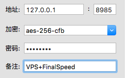
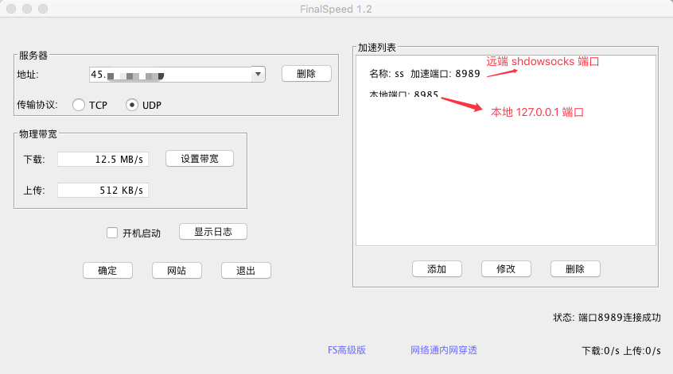

# shadowsocks  & finalspeed 服务端搭建

安装环境：

- ubuntu 14.04, 16.04
- centos
- debian

## 安装Shadowsocks服务端:

如果已经安装shadowsocks，请跳过这步骤。

### 安装

* 使用root用户登录，按顺序运行以下命令：

	~~~bash
	wget --no-check-certificate https://raw.githubusercontent.com/teddysun/shadowsocks_install/master/shadowsocks-go.sh
	chmod +x shadowsocks-go.sh
	./shadowsocks-go.sh 2>&1 | tee shadowsocks-go.log
	~~~
 脚本安装完成后，已将 shadowsocks-go 加入开机自启动
 

### 配置
* 修改配置文件

	~~~bash
	nano /etc/shadowsocks/config.json
	~~~
	    
   - 单用户配置
   
	   ~~~json
	   {
	    "server":"0.0.0.0",
	    "server_port": 13839,
	    "local_port":1080,
	    "password":"jkdf7nd33eUj",
	    "method":"aes-256-cfb",
	    "timeout":600
	   }
	   ~~~   
   
   - 多用户配置
   
	   ~~~json
	   {
	    "port_password":{
	         "13839":"jkdf7nd33eUj",
	         "12179":"Ka7KGb4gqwtF",
	         "16713":"fJArFv1gQ8Ve",
	         "18711":"4aZtRq4frGf5",
	         "17739":"e1PDAM35rYG9"
	    },
	    "method":"aes-256-cfb",
	    "timeout":600
		}
	   ~~~
	   
	- 修改完后，重启服务
 
	   ~~~bash
	   /etc/init.d/shadowsocks restart
	   ~~~
  
###  管理
* 启动  
	`/etc/init.d/shadowsocks start`
* 停止  
	`/etc/init.d/shadowsocks stop`
* 重启  
	`/etc/init.d/shadowsocks restart`
* 状态  
	`/etc/init.d/shadowsocks status`
  
  

## 安装finalspeed:

### 安装

```bash
rm -f install_fs.sh
wget  https://github.com/ucoker/finalspeed/raw/master/install_fs.sh
chmod +x install_fs.sh
./install_fs.sh 2>&1 | tee install.log
```

安装成功后会出现如下提示

```
Archive:  finalspeed_server.zip
  inflating: /fs/fs.jar              
  inflating: /fs/start.sh            
  inflating: /fs/stop.sh             
  inflating: /fs/restart.sh          
FinalSpeed start,log file: /fs/server.log

FinalSpeed server starting... 
System Name: linux
Listen udp port: 150
Listen tcp port: 150
Network Interface List: 
     eth0
  Pseudo-device that captures on all interfaces   any
     lo
Selected Network Interface:
     eth0
FinalSpeed server start success.
```

添加开机启动

~~~bash
nano /etc/rc.local
~~~

在exit 0 之前 加入 
  
~~~bash
sh /fs/start.sh
~~~

###  开放端口

如果没有设置防火墙，此步骤可跳过。

```bash
service iptables start
iptables -A INPUT -p tcp --dport 你的vps端口号 -j ACCEPT
iptables -A OUTPUT -p tcp --sport 你的vps端口号 -j ACCEPT
service iptables save
```

###  管理

* 更新：  
执行一键安装会自动完成更新。
* 卸载：  
`sh /fs/stop.sh ; rm -rf /fs`
* 启动：  
`sh /fs/start.sh`
* 停止：  
`sh /fs/stop.sh`
* 重新启动：  
`sh /fs/restart.sh`
* 运行日志：  
`tail -f /fs/server.log`

### 客户端配置

例如：远端shadowsocks端口是8989,本地加速端口是8985,配置应该如下：

先下载并安装  [shadowsocks Mac 客户端](https://github.com/shadowsocks/shadowsocks-iOS/releases)

- 配置`shadowsocks 客户端` 

	新增服务器配置如下：  
	端口写本地加速端口8985  
	密码跟加密方式应该填写远端shadowsocks对应的配置。	

	
	
再下载并安装  [FinalSpeed 客户端](https://github.com/ucoker/finalspeed/tree/master/client)

- 配置`FinalSpeed 客户端` 
	
	地址写远端服务器IP，传输协议使用UDP，物理带宽根据自己网络设定。  
	添加加速端口，如下图：
	
	

- 在谷歌浏览器或者可以使用sock5代理的地方设置

	`127.0.0.1 1080`


## 参考
* [Finalspeed备份 by dupontjoy](https://github.com/dupontjoy/customization/tree/master/Rules/Shadowsocks/Finalspeed)
* [Shadowsocks-go一键安装脚本](https://teddysun.com/392.html)
* [黑科技，效果逆天！使用FinalSpeed给搬瓦工(Bandwagonhost)加速](https://blog.kuoruan.com/82.html)


## 许可

[MIT](http://opensource.org/licenses/MIT) © [UCOKER CHAN](https://github.com/ucoker)
